# Stewart 平台完整仿真流程技术报告

## 摘要

本项目建立了一套从 Stewart 并联平台多体建模、理想执行器控制，到 PWM 物理执行器、力辨识和状态估计的分层仿真体系。项目要回答的核心问题是：

> 给定平台参考位姿、参考速度和六腿前馈力，Stewart 平台在理想执行器与实际 PWM 执行器条件下能否准确完成轨迹跟踪？当六腿真实输出力无法直接测量时，能否仅利用 PWM 命令、六腿编码器和位姿测量，完成腿力估计与闭环控制？

当前工程包含两套相互校验、但尚未完全统一的仿真环境：

1. **Simscape Multibody 多体物理仿真**：用于 Run02、Run03 和 Run04，显式建模固定平台、六条支链、动平台、负载、关节、重力和运动传感器。Run02 采用理想六腿轴向力源。
2. **MATLAB 数值闭环仿真**：用于完整 PWM 执行器、灰箱加残差 NARX 力估计、偏置状态 UKF 和双线闭环对比。平台动力学参数与 Simscape 对齐，但完整 PWM 辨识闭环目前尚未全部接入 `.slx`。

报告不展开轨迹优化算法，只将已发布轨迹中的时间、位姿、速度、腿长和前馈腿力视为给定输入。重点介绍这些输入如何进入仿真对象、控制器如何形成六腿指令、传感器信号如何进入估计器，以及各层模型如何通过图表和数值结果进行验证。

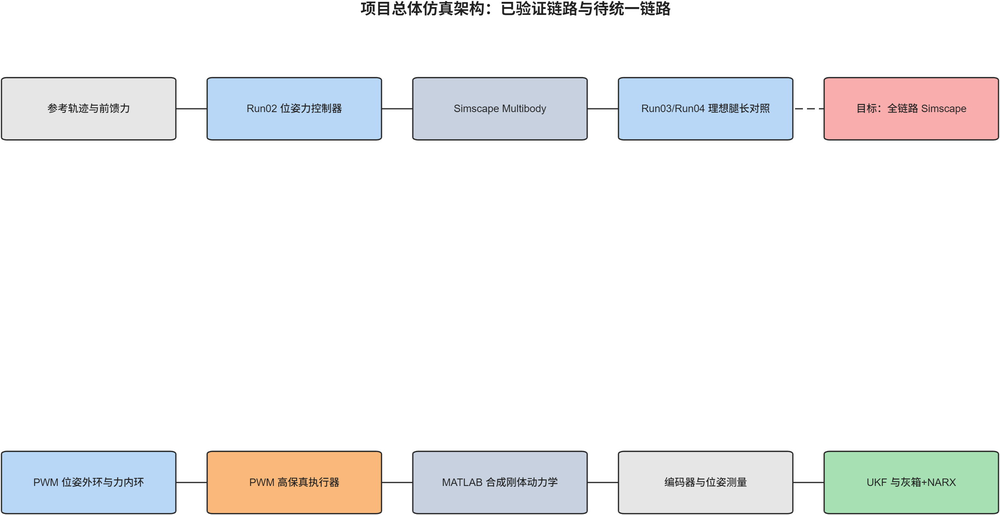

**图 1 的阅读方式。** 上方链路表示当前已经在 Simscape Multibody 中完成的理想执行器基准；下方链路表示完整 PWM 物理对象和辨识反馈的 MATLAB 数值闭环。虚线表示已经建立接口原型、但仍需进一步完成的全链路 Simscape 集成。这个边界非常重要：宏观对比能够回答“实际化之后性能下降多少”，但不能被解释为所有方案均在同一个 `.slx` 中只替换了一个模块。

---

## 1. 仿真环境与工程入口

### 1.1 软件环境

工程运行环境为 MATLAB R2025b，主要依赖：

- MATLAB：参数管理、运动学、动力学、辨识、数据处理和绘图；
- Simulink：控制器、参考信号、Variant 和日志信号组织；
- Simscape Multibody：Stewart 平台刚体、关节、支链、负载与重力仿真；
- Control System Toolbox：模型线性化、`pidtune` 和闭环稳定性检查；
- Optimization Toolbox：灰箱参数的约束优化；
- Sensor Fusion and Tracking Toolbox：偏置状态 UKF。

关键模型和入口为：

| 对象 | 入口或文件 | 作用 |
|---|---|---|
| Simscape 多体模型 | `matlab/stewart_platform_model.slx` | 理想执行器与多体物理仿真 |
| 单条支链模型 | `simscape_subsystems/stewart_strut.slx` | 关节、杆件、Prismatic Joint 和执行器 Variant |
| 理想力位姿控制 | `opt_minimal/run_02_simscape_length_control.m` | Run02 |
| 理想腿长串级控制 | `opt_minimal/run_03_simscape_length_cascade_control.m` | Run03 |
| 位姿反馈理想腿长控制 | `opt_minimal/run_04_simscape_pose_length_control.m` | Run04 |
| PWM 辨识数据 | `opt_minimal/run_05_generate_pwm_identification_data.m` | 生成训练、验证和测试数据 |
| 灰箱加 NARX 训练 | `opt_minimal/run_06_train_pwm_force_identifier.m` | 训练和闭环精炼 |
| PWM 双线闭环 | `opt_minimal/run_07_compare_pwm_pose_force_control.m` | Oracle 与辨识反馈对比 |

### 1.2 仿真工作流

完整工作流并不是直接点击 `.slx` 运行，而是先由 MATLAB 脚本建立统一参数、参考信号和控制器，再启动仿真并对输出执行硬验收：

1. 建立 Stewart 几何、质量、惯量、约束和重力参数；
2. 将参数映射到 Simscape 基础工作区结构体；
3. 从轨迹文件读取参考节点并重建规则时间网格；
4. 对 Simscape 对象进行线性化并整定控制器；
5. 恢复重力和前馈力，运行完整轨迹；
6. 解析日志、计算误差和约束指标；
7. 对 PWM 模型独立生成数据、训练辨识模型并运行数值闭环；
8. 导出 MAT、CSV、PNG/PDF 和摘要。

---

## 2. Stewart 平台几何模型

### 2.1 坐标系、铰点和位姿

固定平台坐标系记为 \(\{A\}\)，动平台坐标系记为 \(\{B\}\)。平台广义坐标为

\[
q =
\begin{bmatrix}
x & y & z & \phi & \theta & \psi
\end{bmatrix}^{T},
\]

其中前三项为动平台原点在固定坐标系中的位置，后三项为 roll、pitch、yaw。姿态矩阵采用 ZYX 顺序：

\[
R(q)=R_z(\psi)R_y(\theta)R_x(\phi).
\]

当前几何参数为：

| 参数 | 数值 |
|---|---:|
| 固定平台半径 \(r_A\) | \(0.75\,\mathrm{m}\) |
| 动平台半径 \(r_B\) | \(0.50\,\mathrm{m}\) |
| 初始高度 \(z_0\) | \(1.00\,\mathrm{m}\) |
| 初始位姿 | \([0,0,1,0,0,0]^T\) |
| 支链连接映射 | `[6,1,2,3,4,5]` |

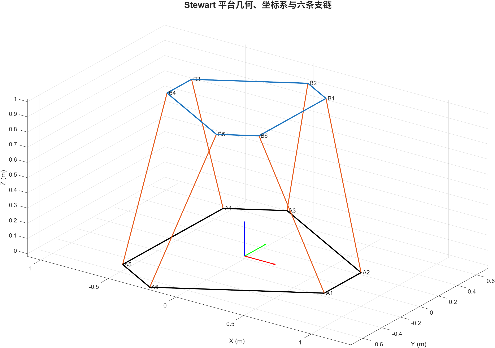

**图 2 展示什么。** 黑色多边形为固定平台，蓝色多边形为动平台，橙色线段为六条支链。图中同时标明下铰点 \(A_i\) 和实际连接的上铰点 \(B_{\mathrm{legMap}(i)}\)。该图用于检查坐标方向、支链交叉关系和初始装配是否正确。

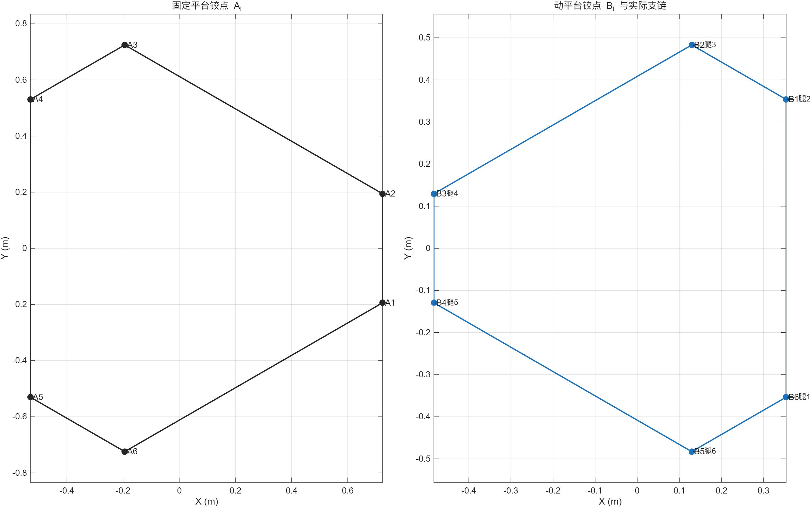

**图 3 为什么必要。** Stewart 平台中“第 \(i\) 条腿”并不一定连接 \(A_i\) 与 \(B_i\)。当前第 1 条腿连接 \(A_1\) 与 \(B_6\)，其余腿依次循环连接。若连接映射错误，初始腿长、Jacobian、Simscape 装配和力方向将同时出错。

### 2.2 单条支链的逆运动学

设固定平台下铰点坐标为 \(A_i\)，动平台上铰点在动平台坐标系中的坐标为 \(B_i\)。动平台上铰点在固定坐标系中的位置为

\[
P_i=p+RB_i.
\]

第 \(i\) 条支链向量、长度和单位方向分别为

\[
s_i=p+RB_i-A_i,
\]

\[
L_i=\|s_i\|,\qquad u_i=\frac{s_i}{L_i}.
\]

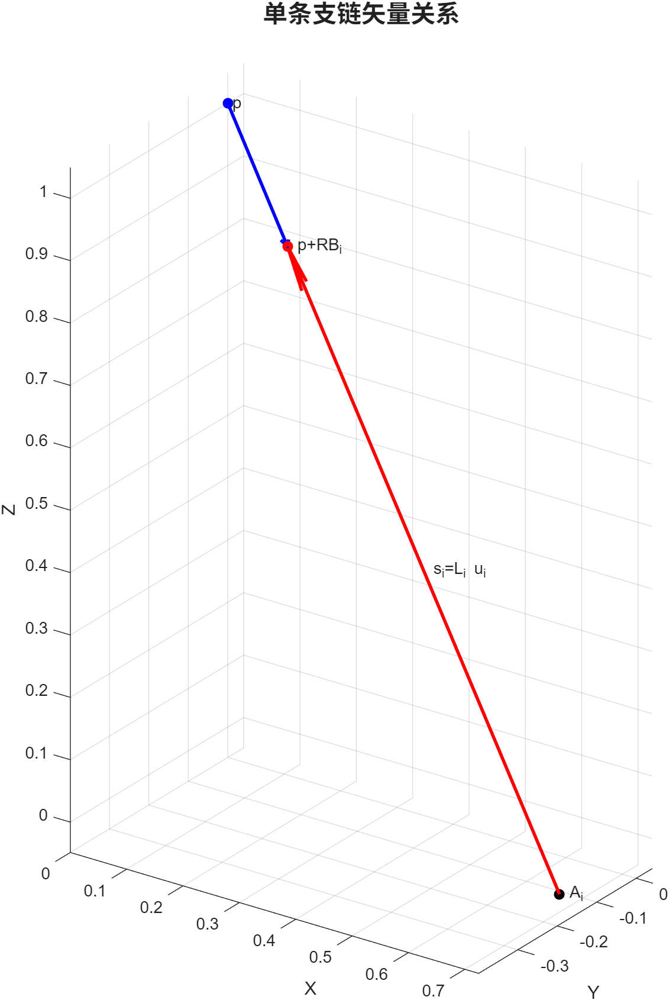

**图 4 的作用。** 该图把逆运动学公式与几何量逐项对应：\(p\) 描述平台整体平移，\(RB_i\) 描述姿态引起的上铰点空间位置，\(s_i\) 决定腿长和轴向力方向。工程中 `sgpIK.m` 即按此关系计算六腿长度、方向和上铰点位置。

---

## 3. Jacobian 与平台动力学

### 3.1 腿速度 Jacobian

上铰点相对动平台原点的空间向量记为 \(r_i=RB_i\)。平台空间速度为

\[
V=
\begin{bmatrix}
v\\ \omega
\end{bmatrix}.
\]

第 \(i\) 条腿长度变化率是上铰点速度在支链方向上的投影，因此

\[
\dot L_i =
\begin{bmatrix}
u_i^T & (r_i\times u_i)^T
\end{bmatrix}
\begin{bmatrix}
v\\ \omega
\end{bmatrix}.
\]

六条腿组合后得到

\[
\dot L=J_v
\begin{bmatrix}
v\\ \omega
\end{bmatrix}.
\]

由于控制和轨迹使用 ZYX 欧拉角速度 \(\dot q\)，还需要角速度映射

\[
\omega=E(\phi,\theta,\psi)\dot q_{\mathrm{rpy}},
\]

从而

\[
\dot L=J_q(q)\dot q.
\]

### 3.2 轴向力到平台广义力

利用虚功原理，六腿轴向力 \(F\) 作用到平台的广义力旋量为

\[
W_{\mathrm{act}}=J_v^TF.
\]

这条关系同时用于：

- 由腿力计算平台动力学响应；
- 将笛卡尔空间控制修正映射为腿力；
- 判断 Jacobian 病态时腿力放大风险。

### 3.3 合成刚体动力学

平台和刚性负载被等效为一个合成刚体，其动力学写成

\[
H(q)\ddot q+W_{\mathrm{bias}}(q,\dot q)=J_v^TF,
\]

其中 \(H(q)\) 为广义质量矩阵，\(W_{\mathrm{bias}}\) 包含重力、科氏项、离心项和坐标映射项。数值闭环中通过

\[
\ddot q=H(q)^{-1}
\left[J_v^TF-W_{\mathrm{bias}}(q,\dot q)\right]
\]

推进平台状态。

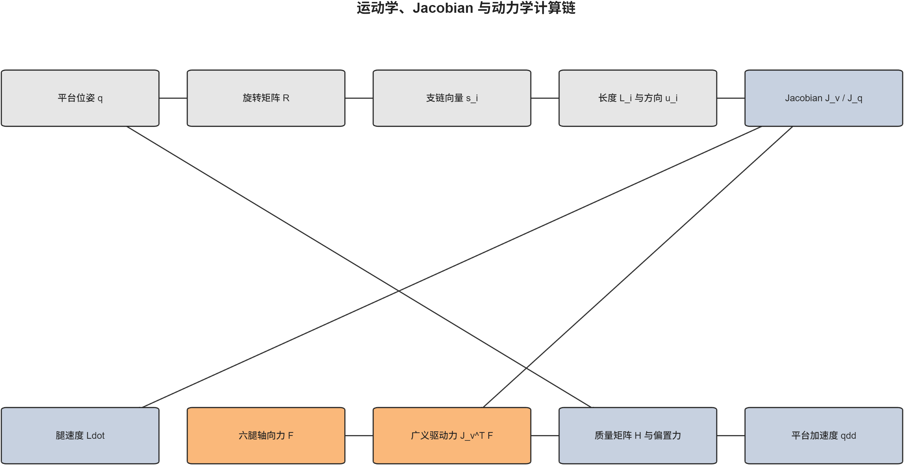

**图 5 展示什么。** 左侧由位姿得到支链几何和 Jacobian；右侧由六腿力得到广义驱动力，并与质量矩阵和偏置力共同计算平台加速度。该图解释了为什么编码器腿长、位姿、腿速度和腿力在闭环中相互耦合。

### 3.4 量纲统一和奇异性

平移列的单位为米，旋转列的单位为弧度，两者不能直接比较。项目使用特征长度

\[
L_c=0.5\,\mathrm{m}
\]

构造归一化 Jacobian，并利用最小奇异值和条件数评价机构远离奇异位置的程度。最小奇异值越小，某些平台运动方向所需腿速度或腿力越容易被放大。

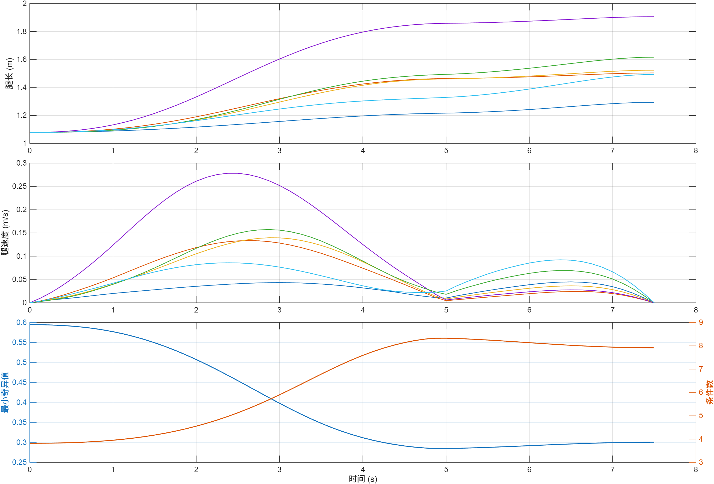

**图 6 的阅读方式。** 前两幅图检查腿长和腿速度是否位于允许范围，第三幅图同时观察最小奇异值与条件数。它们比单独观察平台位姿更能说明轨迹对机构是否可执行。

---

## 4. Simscape Multibody 模型搭建

### 4.1 顶层模型

Simscape 主模型为 `matlab/stewart_platform_model.slx`。顶层模型并不把所有功能堆入一个子系统，而是分为参考输入、控制器、前馈力、Stewart 多体对象、负载、外力、重力配置和日志采集等模块。

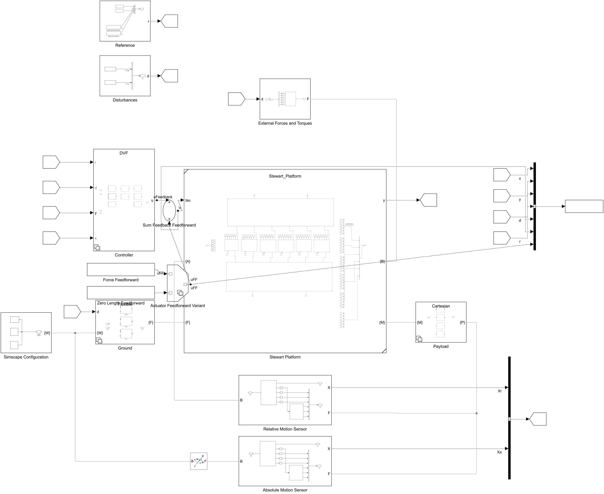

**图 7 展示什么。** 这是由统一导图脚本直接从真实 `.slx` 导出的顶层模型，而不是重新绘制的概念图。关键路径为：

1. `Reference` 输出位姿、腿长等参考；
2. `Controller` 根据参考和传感器反馈生成 `uFeedback`；
3. `Force Feedforward` 输出 `uFF`；
4. `Sum Feedback Feedforward` 计算总输入 \(u=u_{\mathrm{FF}}+u_{\mathrm{Feedback}}\)；
5. `Stewart Platform` 接收六腿输入并输出运动和测量信号；
6. `Relative Motion Sensor` 反馈平台相对位姿；
7. `To Workspace` 将仿真信号统一记录到 `simout`。

### 4.2 Stewart Platform 子系统

Stewart 多体对象由固定平台、六条相同但参数索引不同的支链、动平台和测量链组成。每条腿的上、下铰点位置和初始方向由基础工作区中的 `stewart` 结构体决定。

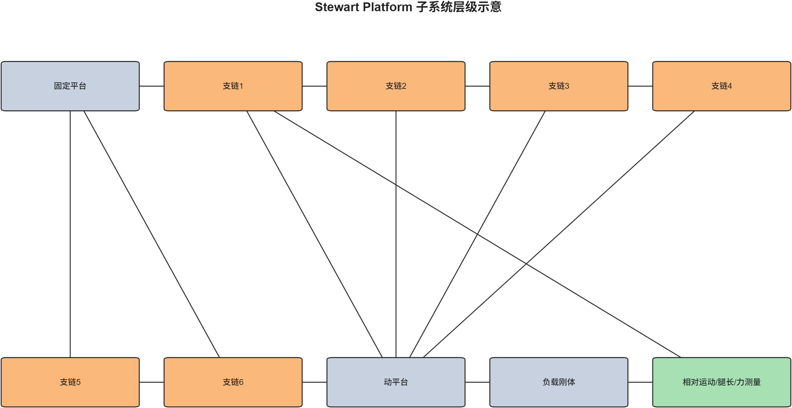

### 4.3 单条支链

单支链模型 `simscape_subsystems/stewart_strut.slx` 包含：

- 固定平台连接；
- 理想万向铰；
- 固定端杆件；
- Prismatic Joint；
- 移动端杆件；
- 理想球铰；
- 动平台连接；
- 执行器 Variant；
- 腿长、腿速度或轴向力测量。

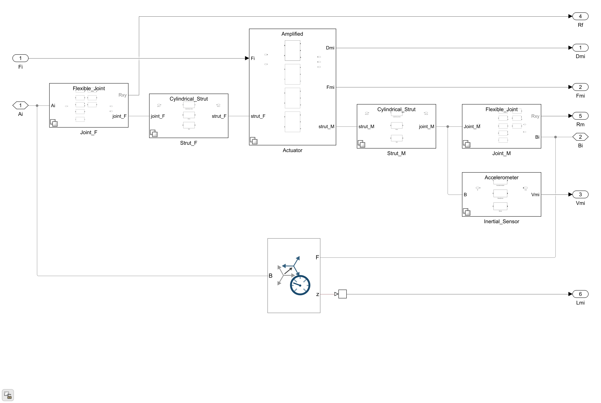

**图 9 的作用。** 支链中的 Prismatic Joint 是腿轴向输入和腿长测量的核心位置。不同控制模式并不重新搭建六腿模型，而是通过 Variant 选择理想力源、理想腿长伺服或 PWM-Physical 原型。

### 4.4 参数从 MATLAB 映射到 Simscape

`buildOptModelCustom.m` 是几何和动力学参数的单一来源。`buildSimscapeLengthControlData.m` 将其转换为 Simscape 使用的：

- `stewart`：平台几何、关节、杆件和执行器配置；
- `payload`：负载形状、质量、惯量、质心和安装姿态；
- `ground`：地面配置；
- `disturbances`：外扰配置；
- `controller`：控制器 Variant；
- `gravity`：运行时重力。

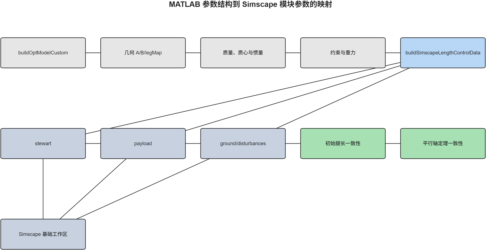

参数映射后执行两类一致性检查。

第一类是初始腿长一致性：

\[
\max_i|L_{i,\mathrm{Simscape}}-L_{i,\mathrm{IK}}|<10^{-10}.
\]

第二类是平台和负载的合成刚体一致性。负载惯量通过平行轴定理转移：

\[
I_O=I_C+m\left(\|d\|^2I-dd^T\right).
\]

当前建模参数和假设为：

| 项目 | 设置 |
|---|---:|
| 动平台质量 | \(50\,\mathrm{kg}\) |
| 刚性圆柱负载质量 | \(100\,\mathrm{kg}\) |
| 合成总质量 | \(150\,\mathrm{kg}\) |
| 重力 | \([0,0,-9.81]^T\,\mathrm{m/s^2}\) |
| 理想力基准中的腿刚度和阻尼 | 0 |
| 每段杆件数值正则质量 | \(10^{-3}\,\mathrm{kg}\) |

杆件正则质量只用于避免 Simscape Multibody 中出现退化质量分布，并不代表真实支链质量。完整的支链惯量、柔性和间隙尚未进入当前主仿真。

---

## 5. 参考轨迹进入仿真的方式

### 5.1 输入契约

轨迹优化只作为上游数据源。仿真需要的字段为

\[
\{t,q,\dot q,F_{\mathrm{leg}},L,q_0\}.
\]

其中：

- \(t\)：轨迹节点时间；
- \(q,\dot q\)：节点位姿与广义速度；
- \(F_{\mathrm{leg}}\)：六腿前馈力；
- \(L\)：节点腿长；
- \(q_0\)：初始位姿。

### 5.2 Hermite 参考重建

节点间位姿不能简单线性连接，否则节点处速度不连续，会在腿速度、腿加速度和驱动力中引入不真实的高频纹波。项目使用分段三次 Hermite 多项式：

\[
q(\tau)=h_{00}q_k+h_{10}\Delta t\dot q_k
+h_{01}q_{k+1}+h_{11}\Delta t\dot q_{k+1}.
\]

重建位姿后，在相同规则时间网格上同步计算

\[
L=\mathrm{IK}(q),\qquad \dot L=J_q(q)\dot q.
\]

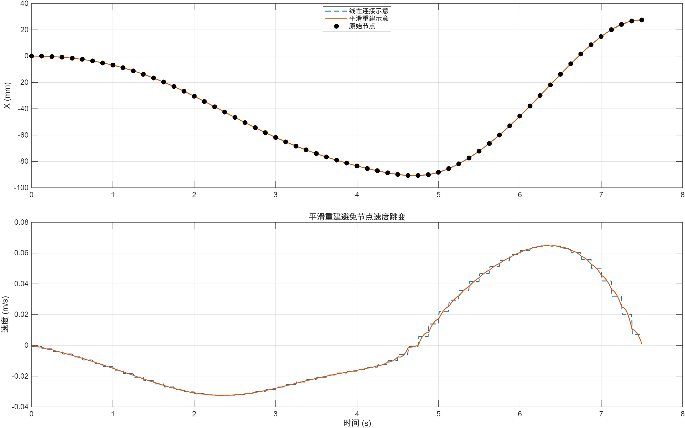

**图 11 为什么重要。** 它说明仿真中的高频误差可能来自参考信号本身，而不是控制器。使用位姿和速度共同约束的 Hermite 重建后，节点处速度更加连续。

### 5.3 Simscape 输入信号

重建后的数据转换为基础工作区 `timeseries`：

\[
\texttt{references.r}=q-q_0,
\]

\[
\texttt{references.rL}=L-L_0,
\]

\[
\texttt{references.rLd}=\dot L,
\]

\[
\texttt{references.uFF}=F_{\mathrm{leg}}.
\]

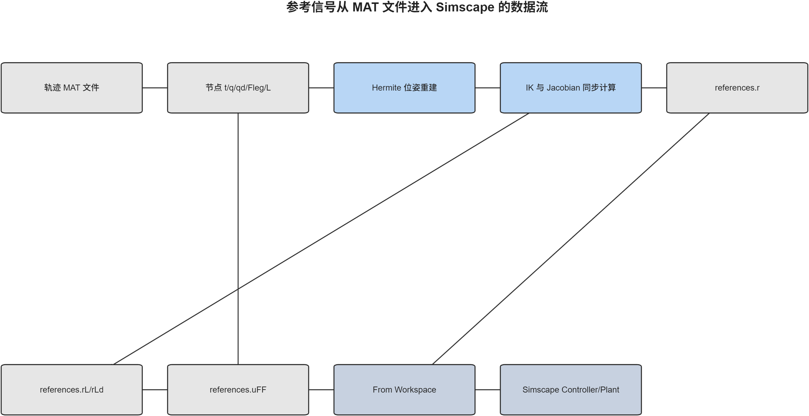

---

## 6. Run02：理想六腿力输入位姿控制

### 6.1 控制结构

Run02 是项目的理想力执行器基准。其总腿力为

\[
u=u_{\mathrm{FF}}+u_{\mathrm{Feedback}},
\]

\[
u_{\mathrm{FF}}=F_{\mathrm{leg}}.
\]

前馈力承担主要的重力和运动需求，反馈力只修正模型误差和跟踪误差。当前结果中最大前馈力约为 \(1092.7\,\mathrm{N}\)，最大反馈力约为 \(7.64\,\mathrm{N}\)，表明理想模型中轨迹前馈已覆盖主要动力学需求。

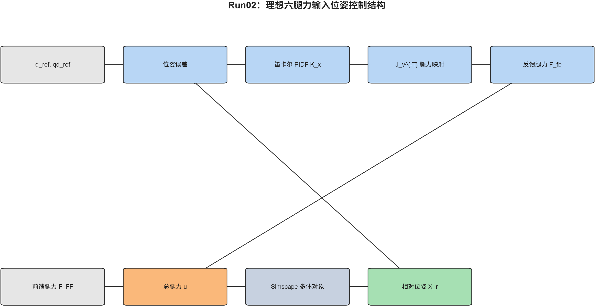

### 6.2 控制器设计

控制器不是直接凭经验写入六腿 PID，而是基于 Simscape 模型线性化：

1. 暂时关闭重力；
2. 暂时将 `references.uFF` 清零；
3. 在线性化工作点获取六腿力到平台相对位姿的 \(6\times6\) 对象 \(G_{F\rightarrow X}\)；
4. 在初始位姿计算 \(J_v^{-T}\)，得到笛卡尔控制对象

\[
G_X=G_{F\rightarrow X}J_v^{-T};
\]

5. 对六个对角通道分别执行

\[
K_{x,i}=\operatorname{pidtune}(G_{X,ii},\mathrm{PIDF},2\pi\cdot15);
\]

6. 对平移和旋转通道进行增益缩放；
7. 构造

\[
K=J_v^{-T}K_x;
\]

8. 检查闭环极点实部均为负；
9. 恢复重力和前馈力并运行完整轨迹。

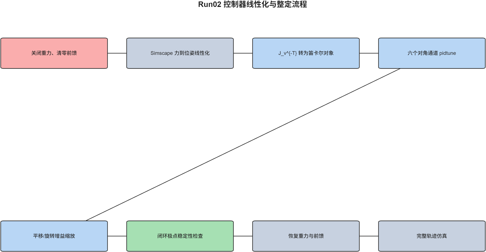

### 6.3 Run02 结果

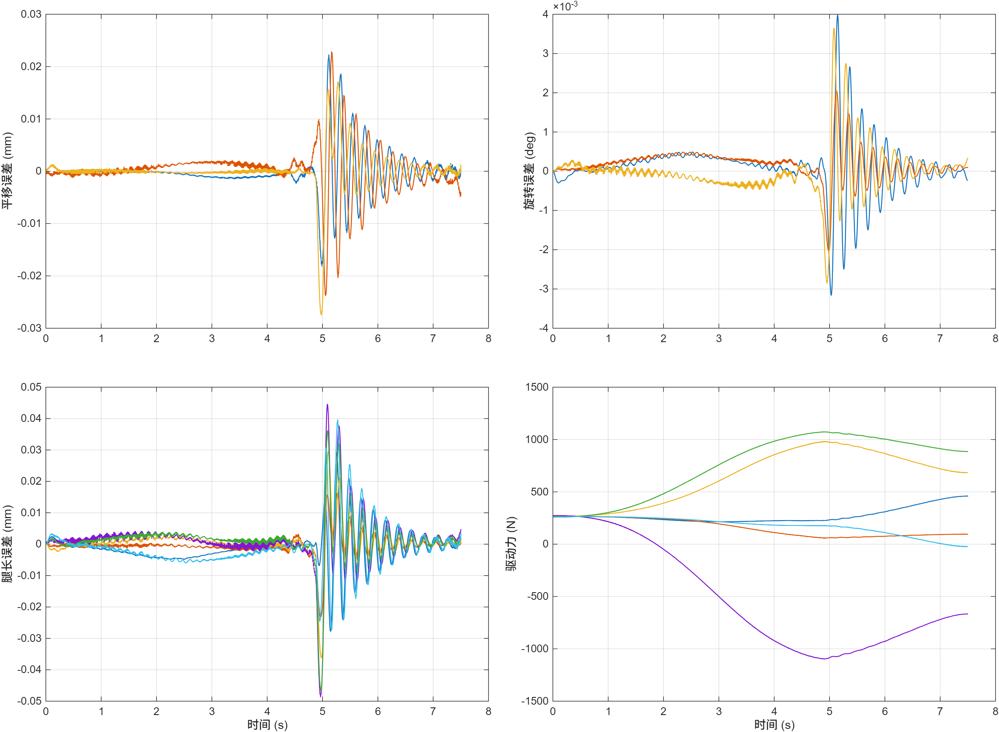

Run02 当前权威结果：

| 指标 | 数值 |
|---|---:|
| 最大腿长跟踪误差 | \(0.0486\,\mathrm{mm}\) |
| 最大分轴平移误差 | \(0.0275\,\mathrm{mm}\) |
| 最大分轴旋转误差 | \(0.0040^\circ\) |
| 最大总驱动力 | \(1097.5\,\mathrm{N}\) |
| 最大腿速度 | \(0.2786\,\mathrm{m/s}\) |
| 最大腿加速度 | \(0.1680\,\mathrm{m/s^2}\) |

因此 Run02 代表“在平台多体模型正确、前馈力准确、执行器能瞬时输出目标腿力”的情况下，系统可达到的理想跟踪水平。它不是实际执行器模型。

---

## 7. Run03 与 Run04：理想腿长控制对照

Run03 和 Run04 用于区分控制结构影响，不作为真实执行器方案。

### 7.1 Run03：理想腿长串级伺服

Run03 使用腿长误差

\[
e_L=L_{\mathrm{ref}}-L
\]

进入位置 P 与速度 PIDF 串级控制，并最终直接规定 Prismatic Joint 的运动。由于执行器能够理想地实现腿长命令，该方案不能回答所需驱动力是否可实现。

### 7.2 Run04：位姿反馈修正腿长

Run04 在 Run03 的腿长参考前加入位姿反馈：

\[
\Delta L_{\mathrm{pose}}
=J_q(q_{\mathrm{ref}})K_{\mathrm{pose}}
(q_{\mathrm{ref}}-q),
\]

\[
e_L=L_{\mathrm{ref}}+\Delta L_{\mathrm{pose}}-L.
\]

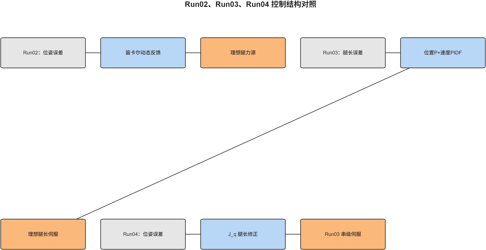

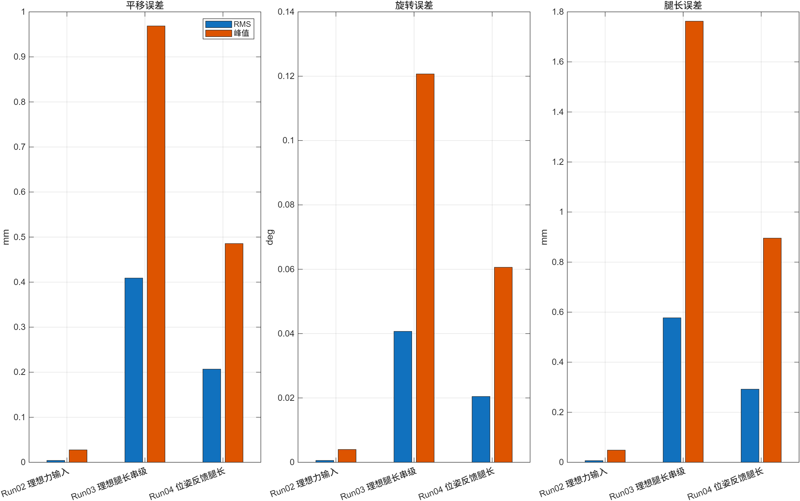

**图 17 能说明什么。** Run02 使用腿力作为物理输入，Run03/Run04 使用理想腿长输入。它们适合比较位姿反馈、腿长反馈和前馈结构的影响，但不能将 Run03/Run04 的误差直接理解为真实执行器性能。

---

## 8. PWM 高保真执行器物理模型

### 8.1 建模目的

真实系统对执行器只能输出有符号 PWM，腿部可以测量编码器长度，但通常不能持续直接测量真实轴向力。因此需要建立一个比理想力源更接近实物的“物理教师模型”，用于：

- 模拟 PWM 到腿力的非线性和动态；
- 生成带真实力标签的辨识数据；
- 评价灰箱和 NARX 是否能够逼近真实对象；
- 比较真实力反馈上限和辨识反馈性能。

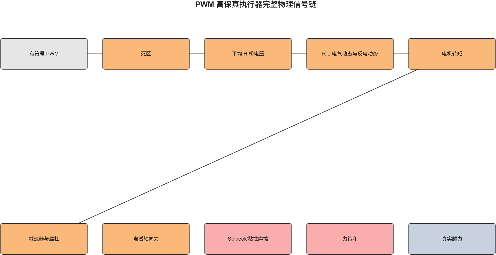

### 8.2 PWM 死区与平均 H 桥

PWM 命令首先被限制在

\[
PWM\in[-4198,4198].
\]

第 \(i\) 轴死区为 \(PWM_{\mathrm{dead},i}\)。死区后的有效 PWM 为

\[
PWM_{\mathrm{eff},i}
=\operatorname{sgn}(PWM_i)
\max(|PWM_i|-PWM_{\mathrm{dead},i},0).
\]

平均 H 桥输出电压为

\[
V_i=V_{\mathrm{bus},i}
\frac{PWM_{\mathrm{eff},i}}{PWM_{\max}}.
\]

六轴死区为 `[620,700,660,760,680,640]`，约占满量程的 \(14.77\%\) 至 \(18.10\%\)。

### 8.3 电气动态、反电动势和丝杠力

电机电气方程为

\[
L_i\frac{di_i}{dt}+R_i i_i+K_{e,i}\omega_{m,i}=V_i.
\]

腿速度与电机速度关系为

\[
\omega_{m,i}=\dot L_i\frac{2\pi N_i}{p_i}.
\]

电磁轴向力为

\[
F_{\mathrm{em},i}
=K_{t,i}i_iN_i\frac{2\pi}{p_i}\eta_i.
\]

因此同一个 PWM 在不同腿速度下不会产生完全相同的力：腿速度增大时，反电动势增大，可用电流和轴向力下降。

### 8.4 摩擦和力饱和

摩擦模型包含静摩擦、库仑摩擦、Stribeck 低速变化和黏性摩擦：

\[
F_{f,i}=
\operatorname{sgn}(\dot L_i)
\left[
F_{c,i}+(F_{s,i}-F_{c,i})
e^{-(|\dot L_i|/v_{s,i})^2}
\right]
+B_i\dot L_i.
\]

低速停止时，若驱动力未超过静摩擦，则摩擦力抵消驱动力。最终输出腿力为

\[
F_{\mathrm{true},i}
=\operatorname{sat}
(F_{\mathrm{em},i}-F_{f,i},\pm2400\,\mathrm{N}).
\]

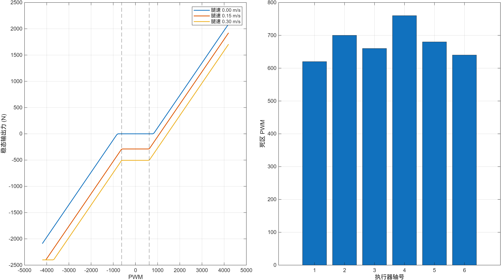

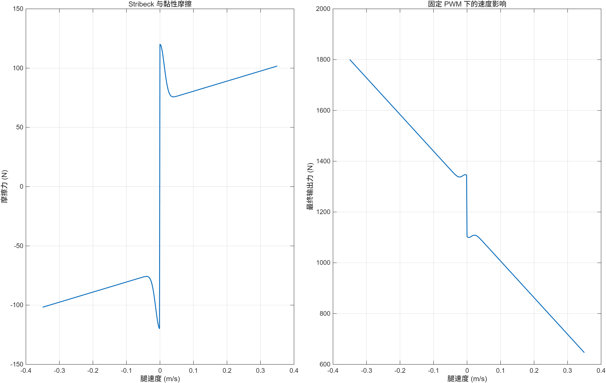

**图 19 和图 20 的意义。** 图 19 显示死区、速度影响和轴间参数离散性；图 20 专门放大低速摩擦。它们解释了为什么简单线性比例 \(F=k\cdot PWM\) 无法覆盖真实执行器。

### 8.5 平均值模型与开关级模型

平台闭环采用平均值 PWM 模型，避免逐个模拟 5 kHz 开关造成过高计算量。为了证明平均模型可用，项目将其与单轴开关级模型进行校验。

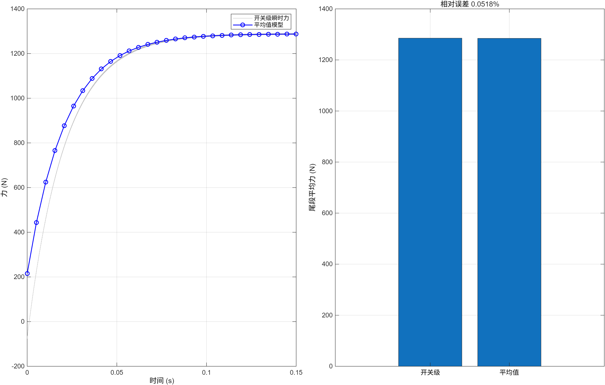

当前单工况尾段平均力相对误差为 \(0.0518\%\)，多轴、多占空比和多腿速度网格中的最大满量程归一化误差为 \(0.5039\%\)。因此平均模型适合当前平台级控制仿真。

### 8.6 当前 Simscape PWM Variant 的边界

`stewart_strut.slx` 已安装 `stewart.actuators.type==6` 的 `PWM-Physical` Variant，当前包含：

- PWM 死区；
- PWM 到平均电压；
- 一阶电气动态；
- 机电力增益；
- 力饱和；
- Prismatic Joint 力输入。

但是完整反电动势速度耦合、Stribeck 摩擦、灰箱加 NARX、UKF 和整个平台 PWM 闭环仍主要运行在 MATLAB 数值闭环中。报告中的 PWM 完整闭环结果应按此边界解释。

---

## 9. 辨识数据、灰箱模型与残差 NARX

### 9.1 辨识数据生成

辨识数据必须覆盖实际闭环可能访问的工况，而不能只使用单一正弦或固定速度。当前 PWM 激励由多正弦与随机阶跃叠加组成，同时平台按照可实现的六自由度运动产生耦合腿速度。

数据集包含：

- 可观测量：PWM、编码器腿长、采集位姿、由采集量计算的腿速度和加速度；
- 隐藏教师量：真实腿力、电流和真实腿速度；
- 数据划分：前 \(60\%\) 训练、随后 \(20\%\) 验证、最后 \(20\%\) 测试。

当前数据集采样周期为 \(5\,\mathrm{ms}\)，总时长 \(30\,\mathrm{s}\)，共 6000 个样本。

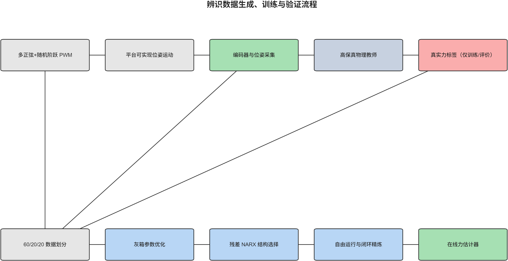

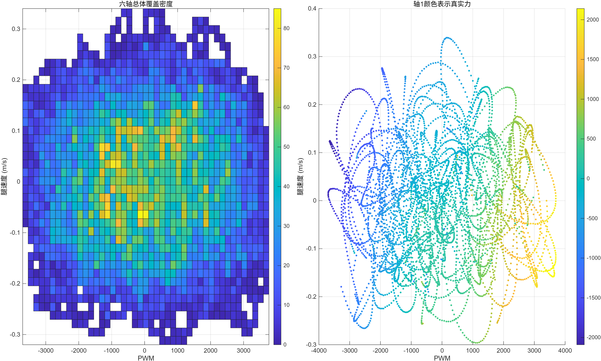

**图 23 的阅读方式。** PWM–腿速度二维覆盖比单独的 PWM 直方图更重要。死区、低速、换向和高速反电动势区域都需要足够样本，否则测试集 NRMSE 较低也不能证明闭环泛化能力。

现实系统中若没有持续力传感器，训练阶段仍需要某种可信的力标签来源，例如临时串联力传感器、测力台标定或经验证的动力学观测器。否则只能辨识 PWM 到腿长或运动响应，不能直接监督训练 PWM 到力模型。

### 9.2 灰箱模型

灰箱模型保留 PWM 执行器的物理结构，但允许关键参数相对初值缩放。当前辨识参数包括：

- 转矩常数；
- 反电动势常数；
- 电感；
- 库仑摩擦；
- 静摩擦；
- Stribeck 速度；
- 黏性摩擦；
- PWM 死区。

训练目标对低速区域加权：

\[
J(\theta)
=\frac{1}{N}
\sum_k w(\dot L_k)
\left[
\frac{\hat F_{\mathrm{gray},k}(\theta)-F_{\mathrm{true},k}}
{F_{\mathrm{limit}}}
\right]^2,
\]

\[
w(\dot L)=1+2e^{-(|\dot L|/0.03)^2}.
\]

低速加权是因为死区、静摩擦和换向误差主要集中在该区域。

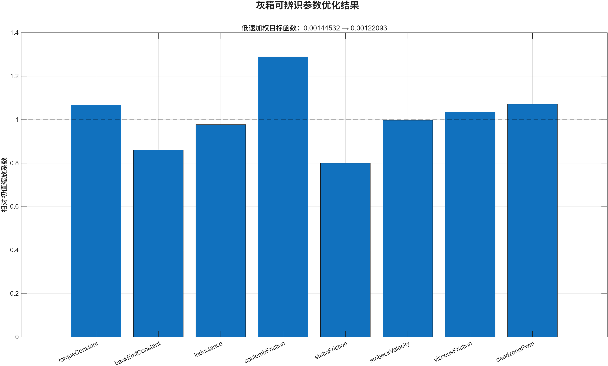

### 9.3 残差 NARX

灰箱模型能够描述主要物理关系，但实际对象仍可能包含未建模非线性。因此采用残差 NARX：

\[
F_{\mathrm{true},k}
=F_{\mathrm{gray},k}+r_k,
\]

\[
\hat r_k=f(z_k,z_{k-1},\hat r_{k-1},\hat r_{k-2}).
\]

候选回归项包括：

- PWM、腿速度、腿加速度和灰箱力；
- PWM 平方、速度平方和交叉项；
- PWM 与速度符号；
- 低速指数项；
- PWM 和速度变化量；
- 历史灰箱力与历史残差。

训练阶段使用教师真实残差，部署阶段递推使用预测残差。因此模型选择不能只看一步预测误差，还必须检查自由运行或多步预测输出是否稳定。当前实现同时比较稀疏候选结构与稳健基线结构；若稀疏结构在闭环中放大误差，则保留更稳健的残差结构。

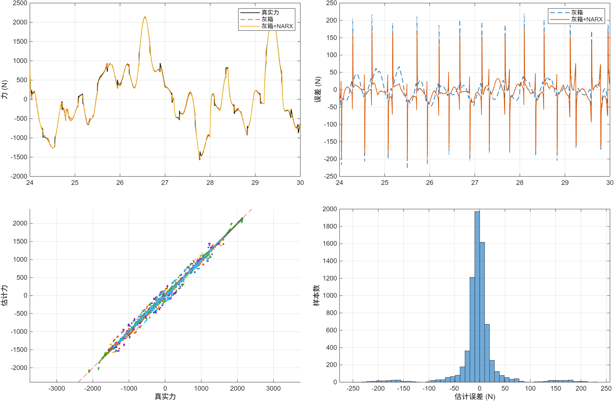

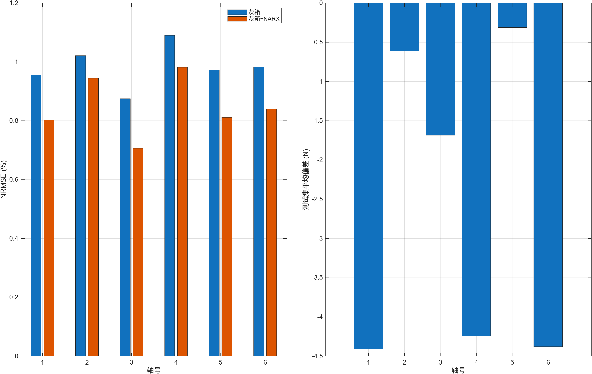

当前独立测试集结果：

| 模型 | NRMSE |
|---|---:|
| 灰箱 | \(0.9849\%\) |
| 灰箱加 NARX | \(0.8527\%\) |
| 相对改善 | \(13.42\%\) |

这里 NRMSE 定义为

\[
\mathrm{NRMSE}
=\frac{\sqrt{\frac{1}{N}\sum_k(\hat F_k-F_k)^2}}
{F_{\max}-F_{\min}}.
\]

项目采用 \(4800\,\mathrm{N}\) 的完整力范围归一化。NRMSE 便于比较不同数据集，但应同时报告 RMS、峰值和偏差，避免归一化范围掩盖局部大误差。

### 9.4 闭环数据精炼

离线激励数据分布不一定等于最终闭环分布。初始模型训练完成后，项目在一条与最终评价轨迹不同、幅值缩放且带宽较低的闭环轨迹上运行辨识反馈，并将新增样本加入训练集重新训练。该步骤用于减小

\[
p_{\mathrm{offline}}(PWM,\dot L)
\neq
p_{\mathrm{closed-loop}}(PWM,\dot L)
\]

造成的分布偏移，同时避免直接使用最终评价轨迹进行训练。

---

## 10. 位姿、速度和腿力估计

### 10.1 为什么不能直接差分编码器

编码器腿长可直接测量，但速度需要差分。即使腿长噪声很小，除以 \(5\,\mathrm{ms}\) 后也会显著放大；再次差分得到加速度时问题更严重。由于灰箱和 NARX 都依赖腿速度与加速度，估计链质量直接影响力估计和力内环。

### 10.2 偏置状态 UKF

当前 UKF 状态为

\[
x=
\begin{bmatrix}
q^T & \dot q^T & b_q^T
\end{bmatrix}^T,
\]

其中 \(b_q\) 为位姿传感器偏置。测量为

\[
z=
\begin{bmatrix}
L_{\mathrm{encoder}}^T &
q_{\mathrm{measured}}^T
\end{bmatrix}^T.
\]

UKF 使用运动模型预测位姿和速度，使用逆运动学预测腿长，并将编码器和位姿测量共同用于校正。偏置状态按随机游走建模，使滤波器能够逐渐分离真实运动和传感器慢变偏置。

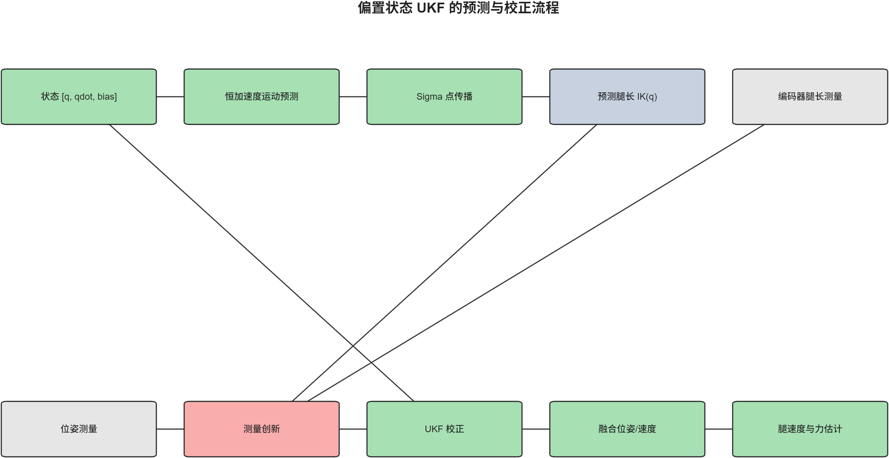

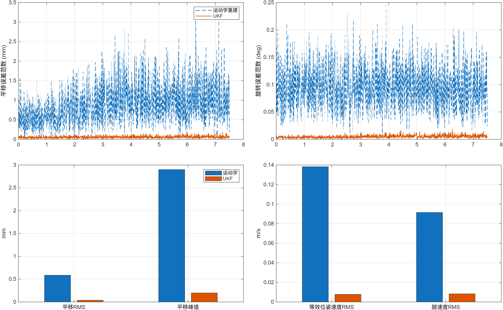

独立基准结果：

| 方法 | 平移 RMS | 平移峰值 | 腿速度 RMS |
|---|---:|---:|---:|
| 运动学重建 | \(0.5861\,\mathrm{mm}\) | \(2.8989\,\mathrm{mm}\) | \(0.09146\,\mathrm{m/s}\) |
| 偏置状态 UKF | \(0.0373\,\mathrm{mm}\) | \(0.1974\,\mathrm{mm}\) | \(0.00831\,\mathrm{m/s}\) |

UKF 的主要收益不只是位姿误差降低，更重要的是显著改善速度链，从而为力估计和反馈控制提供可用输入。

### 10.3 在线腿力估计及一拍延迟

在线灰箱加 NARX 估计器仅使用

\[
PWM_k,\quad \hat{\dot L}_k,\quad \hat{\ddot L}_k
\]

递推输出腿力估计。控制器在第 \(k\) 拍发出 PWM 后，物理对象产生的新力只能在下一拍进入反馈，因此因果对齐应比较

\[
\hat F_k\leftrightarrow F_{\mathrm{true},k-1}.
\]

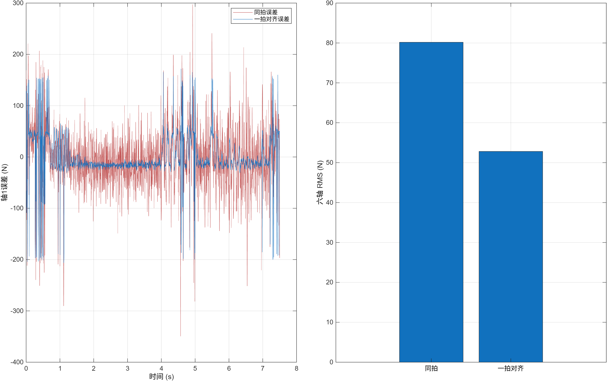

当前一拍对齐后的在线力估计 RMS 为 \(52.823\,\mathrm{N}\)，NRMSE 为 \(1.1005\%\)；若错误地进行同拍比较，RMS 增大到 \(80.176\,\mathrm{N}\)。这说明闭环分析必须把采样时序作为模型的一部分。

---

## 11. PWM 位姿外环与力内环

### 11.1 位姿外环

位姿外环根据参考与融合估计计算

\[
e_q=q_{\mathrm{ref}}-\hat q,
\qquad
e_{\dot q}=\dot q_{\mathrm{ref}}-\hat{\dot q}.
\]

平台广义修正力旋量为

\[
\Delta W=
K_pe_q+K_de_{\dot q}
+K_i\int e_qdt.
\]

通过当前估计位姿的 Jacobian 将其转为腿力修正：

\[
\Delta F_{\mathrm{leg}}
=J_v(\hat q)^{-T}\Delta W.
\]

最终目标腿力为

\[
F_{\mathrm{target}}
=F_{\mathrm{FF}}+\Delta F_{\mathrm{leg}}.
\]

### 11.2 力内环

力内环由灰箱逆模型前馈和 PI 反馈组成。逆模型先根据目标力、腿速度、摩擦和反电动势计算主要 PWM：

\[
i_{\mathrm{des}}
=\frac{F_{\mathrm{target}}+\hat F_f}
{K_tN(2\pi/p)\eta},
\]

\[
V_{\mathrm{des}}
=Ri_{\mathrm{des}}+K_e\omega_m.
\]

随后加入死区补偿，并由 PI 修正剩余力误差：

\[
PWM=
PWM_{\mathrm{FF}}
+K_{pf}(F_{\mathrm{target}}-\hat F)
+K_{if}\int(F_{\mathrm{target}}-\hat F)dt.
\]

控制器同时包含：

- PWM 满量程限幅；
- PWM 每拍变化率限制；
- 积分限幅；
- 饱和时停止积分的抗饱和逻辑；
- 死区、摩擦和反电动势前馈补偿。

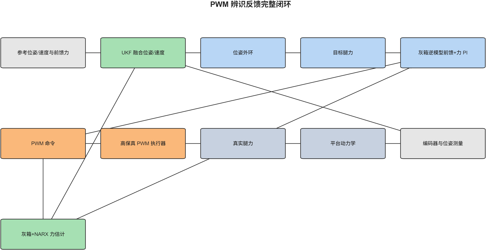

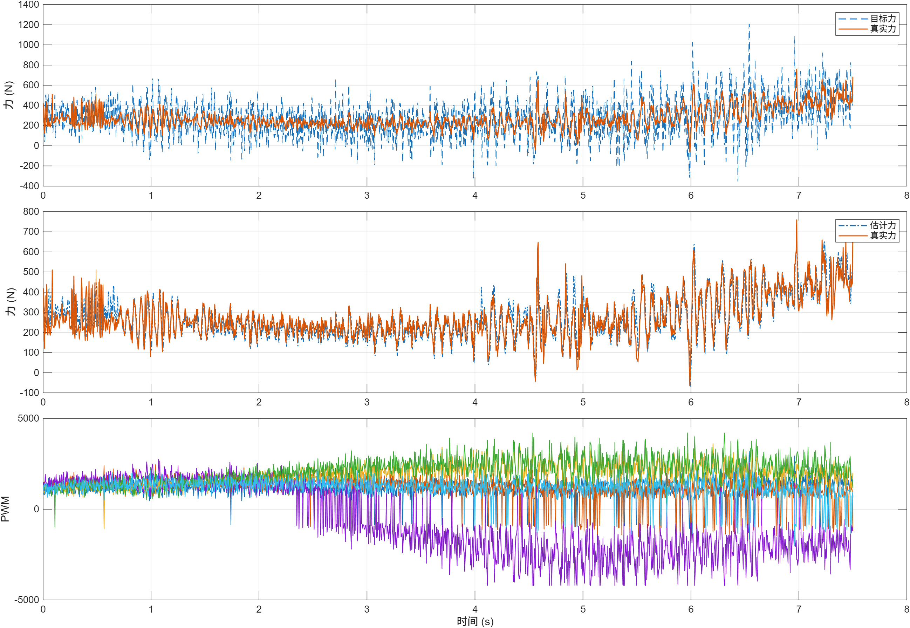

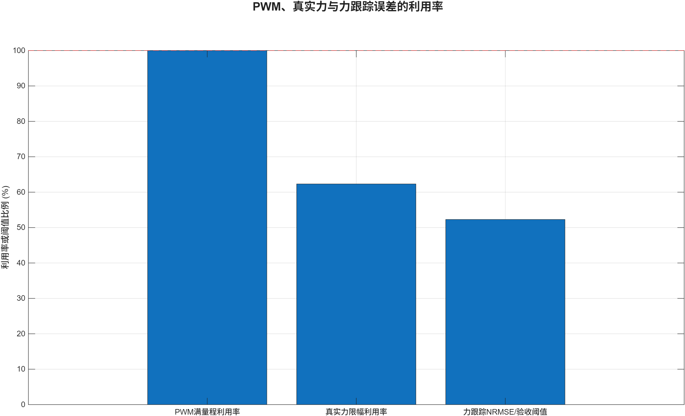

当前 PWM 已达到 \(100\%\) 满量程利用率，而真实力只达到力限幅的 \(62.32\%\)。这说明部分性能限制首先来自可用电压、死区和 PWM 变化率，而不只是 \(\pm2400\,\mathrm{N}\) 的机械力限幅。继续单纯提高力 PI 增益可能加剧 PWM 饱和和噪声放大。

---

## 12. 仿真执行、日志与硬验收

### 12.1 推荐运行顺序

在仓库根目录运行：

```matlab
run('opt_minimal/run_02_simscape_length_control.m')
run('opt_minimal/run_03_simscape_length_cascade_control.m')
run('opt_minimal/run_04_simscape_pose_length_control.m')

run('opt_minimal/run_05_generate_pwm_identification_data.m')
run('opt_minimal/run_06_train_pwm_force_identifier.m')
run('opt_minimal/run_07_compare_pwm_pose_force_control.m')
```

如需打开已准备完成的 Simscape 模型并手动运行：

```matlab
simscapeRunMode = 'manual';
run('opt_minimal/run_02_simscape_length_control.m')
```

生成本报告全部配图：

```matlab
addpath('opt_minimal/tools')
exportCompleteSimulationWorkflowFigures()
```

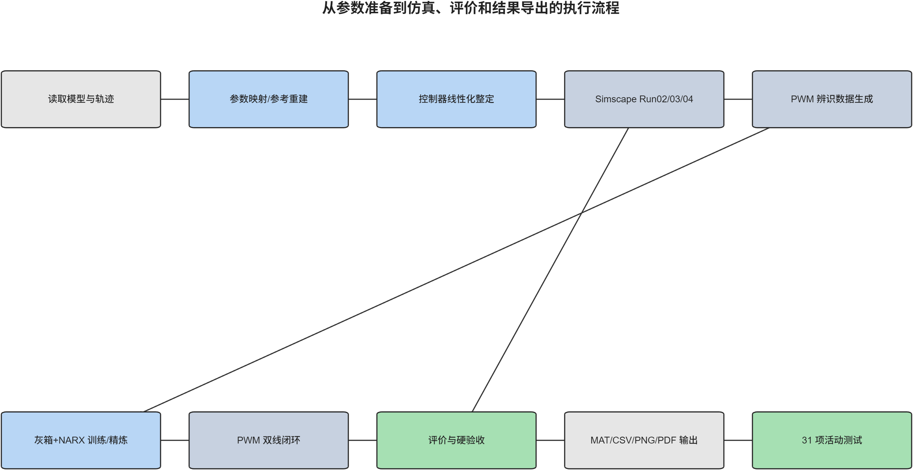

### 12.2 结果文件

每条主线均保存：

- `result_*.mat`：设置、原始日志、报告和指标；
- `summary_*.txt` 或 `summary.md`：便于人工审阅的数值摘要；
- `tracking_*.png`：单次运行诊断图；
- `metrics.csv`：便于表格和自动化处理的指标。

### 12.3 硬验收内容

Simscape 和 PWM 闭环不以“仿真跑完”作为成功标准，而是同时检查：

- 信号有限性；
- Simscape 参数映射一致性；
- 线性化闭环稳定性；
- 腿长上下限；
- 腿速度和腿加速度约束；
- 腿力和 PWM 限幅；
- 位姿与腿长跟踪误差；
- 灰箱/NARX 独立测试 NRMSE；
- NARX 自由运行稳定性；
- PWM 平均模型与开关级模型一致性；
- 辨识反馈线不读取真实位姿和真实力；
- 完整轨迹最终验收。

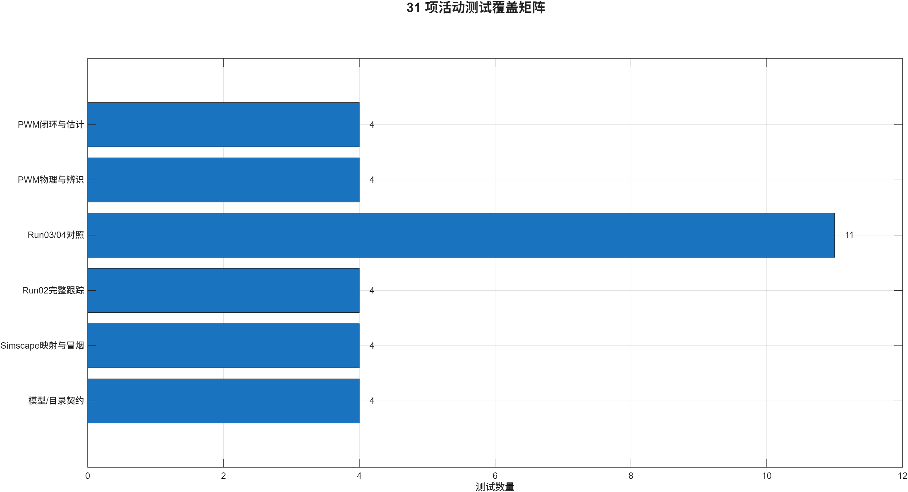

活动测试入口为：

```matlab
run('opt_minimal/tests/run_all_active_tests.m')
```

当前测试共 31 项，覆盖模型契约、参数映射、Simscape 冒烟和完整轨迹、三种理想控制、PWM 物理模型、辨识、双线闭环和位姿估计器。

---

## 13. 系统级结果与行业解释

### 13.1 三种主方案

最终宏观对比包含：

1. **Simscape 理想力源**：Run02，多体对象和重力真实存在，但执行器可以瞬时准确输出目标腿力；
2. **PWM 物理对象加真实反馈**：完整 PWM 物理对象，控制器可读取真实位姿、速度和真实腿力，表示执行器物理限制下的性能上限；
3. **PWM 物理对象加辨识反馈**：完整 PWM 物理对象，控制器使用 UKF 位姿/速度和灰箱加 NARX 力估计，最接近未来实物可部署信息结构。

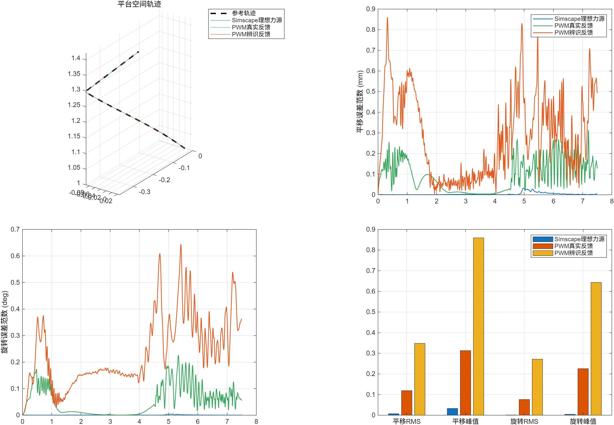

| 方案 | 平移 RMS | 平移峰值 | 旋转 RMS | 旋转峰值 |
|---|---:|---:|---:|---:|
| Simscape 理想力源 | \(0.0071\,\mathrm{mm}\) | \(0.0327\,\mathrm{mm}\) | \(0.0010^\circ\) | \(0.0044^\circ\) |
| PWM 物理对象加真实反馈 | \(0.1190\,\mathrm{mm}\) | \(0.3130\,\mathrm{mm}\) | \(0.0761^\circ\) | \(0.2255^\circ\) |
| PWM 物理对象加辨识反馈 | \(0.3479\,\mathrm{mm}\) | \(0.8594\,\mathrm{mm}\) | \(0.2714^\circ\) | \(0.6433^\circ\) |

### 13.2 误差来源拆分

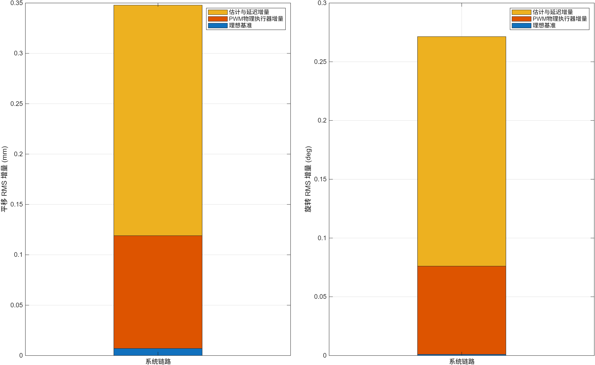

从理想力源到 PWM 真实反馈，平移 RMS 放大约 16.8 倍。这部分主要来自：

- PWM 死区；
- 电气动态和反电动势；
- 摩擦和换向；
- PWM 饱和与变化率限制；
- 有限带宽的力内环。

从 PWM 真实反馈到辨识反馈，平移 RMS 再放大约 2.92 倍，旋转 RMS 放大约 3.57 倍。这部分主要来自：

- 位姿测量噪声和偏置；
- 速度与加速度估计误差；
- 力估计误差；
- 一拍因果延迟；
- 估计误差通过位姿外环和力内环共同反馈。

### 13.3 当前结论

1. **Simscape 多体模型和参数映射已经形成可信的理想执行器基准。**  
   Run02 在重力、平台和负载刚体动力学存在的条件下，实现了很小的位姿和腿长误差，可用于检查几何、坐标、前馈力和控制结构。

2. **PWM 物理模型能够明显揭示理想力源无法体现的性能损失。**  
   即使控制器能够读取真实状态，PWM 物理对象仍显著降低跟踪精度，说明执行器动态不能被忽略。

3. **灰箱加残差 NARX 已能较准确地逼近物理教师。**  
   独立测试集 NRMSE 为 \(0.8527\%\)，在线一拍对齐 NRMSE 为 \(1.1005\%\)。但离线辨识精度并不是闭环性能的唯一决定因素。

4. **UKF 对速度链的改善对闭环非常关键。**  
   腿速度 RMS 误差由约 \(0.09146\,\mathrm{m/s}\) 降至 \(0.00831\,\mathrm{m/s}\)，使基于速度和加速度的力估计成为可能。

5. **当前进一步优化的首要矛盾是 PWM 饱和、闭环延迟和估计器闭环鲁棒性。**  
   PWM 已达到满量程，而真实力未达到机械限幅。后续应优先研究母线电压、传动参数、PWM 变化率限制、延迟补偿和观测器闭环设计，而不是只继续降低离线 NRMSE。

---

## 14. 当前实现边界与后续统一方向

### 14.1 已完成

- Stewart 几何、逆运动学、Jacobian 和合成刚体动力学；
- Simscape Multibody 平台、六条支链、负载、重力和测量链；
- Run02 理想力位姿控制；
- Run03/Run04 理想腿长控制对照；
- 完整 PWM 高保真教师模型；
- 平均 PWM 与开关级校验；
- 灰箱参数辨识和残差 NARX；
- 偏置状态 UKF；
- PWM Oracle 与辨识反馈双线数值闭环；
- 31 项活动测试和统一证据图导出。

### 14.2 尚未完成的统一

完整 PWM 闭环尚未全部部署到 `stewart_platform_model.slx`。后续全链路 Simscape 集成应按以下顺序推进：

1. 将反电动势速度耦合和完整摩擦模型接入 `PWM-Physical` Variant；
2. 将六轴 PWM 力内环和灰箱加 NARX 估计器接入 Simulink；
3. 将编码器量化、位姿噪声和偏置模型接入传感器链；
4. 将 UKF 接入 Simulink 并验证采样时序；
5. 在同一 `.slx` 内对理想力源、PWM Oracle 和 PWM 辨识反馈进行严格执行器消融；
6. 加入真实支链质量、柔性、间隙和通信延迟后重新验证。

在完成这些步骤前，当前宏观对比应被解释为“系统级性能对照”，而不是“同一个 Simscape 对象中只替换执行器的严格消融实验”。

---

## 15. 图表复现与文件说明

本报告全部编号图片由以下脚本统一生成：

```matlab
addpath('opt_minimal/tools')
manifest = exportCompleteSimulationWorkflowFigures();
```

输出目录：

```text
opt_minimal/docs/figures/simulation_workflow/
```

每幅图同时包含 PNG 和 PDF。`manifest.csv` 记录图名和绝对输出路径。绘图脚本只读取现有权威结果和模型，不修改控制器、模型参数或 `.slx`。因此报告图可重复生成，并能够与后续最新结果同步更新。
## UKF 实物测量边界更新（2026-06-14）

当前 UKF 已不再融合运行时完整位姿。回零时由六腿固定最短限位和一次性测得的回零位姿建立
`anchorPose/anchorLength`；运动阶段只融合六腿相对编码器、三轴姿态、三轴加速度和三轴角速度。
状态定义为 `[q; qd; accelerometerBias; gyroBias]`，其中加速度支持世界系线加速度和机体系原始比力。

绝对 `x/y/z` 的常量精度由回零位置标定决定。没有新的绝对位置观测时，滤波器可以高精度恢复相对运动和速度，
但不能消除初始绝对位置常量误差。报告必须分别给出绝对误差和扣除首帧锚点误差后的相对误差。

独立基准保留 `1 mm RMS` 编码器噪声结果，并使用 `0.5 mm RMS` 档验证极限精度；旧的“完整位姿测量 UKF”
亚毫米结果不再代表实物可部署性能。PWM 闭环报告同时保留严格旧 `1 mm/轴` 跟踪门槛和实物可部署估计器门槛，
不得通过重新读取位置真值使严格门槛通过。
